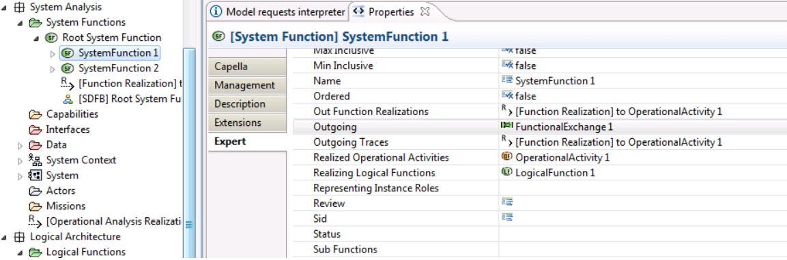

#Metamodel

## Retrieve type of an element

When developping an addon, knowing by heart all metamodels is not relevant, and many of us doesn't know it either.

To manipulate or create an element with a simple API, you just need to know its type. 
It is often displayed on the top left of Property views when you click on an element.

With its type, for instance, a `PhysicalFunction`, you will be able to retrieve its sub functions `((PhysicalFunction)function).getOwnedFunctions()`.

To create a `PhysicalFunction`, you will need to know from which metamodel part it is defined. Using `Open Type` wizard with `Ctrl+Shift+T` and writing the type, you will find its metamodel.

For instance, with `PhysicalFunction`, you will see org.polarsys.capella.xxx.**pa**.PhysicalFunction, meaning it is coming from `pa` metamodel (Physical Architecture)

Using **Pa**Factory, you will have access to `PaFactory.eINSTANCE.createPhysicalFunction()` allowing you to create a Physical Function. 

> To open Open Type wizard, you have to be in Capella Studio, Eclipse development platform or at least within Capella with Java features enabled (see [Development Environment](https://github.com/eclipse/capella/wiki/Development-Environment))  (Make sure you have the view `Package Explorer` active and not the `Project Explorer`)

> Don't forget to add some dependencies to your plugin, at least `org.polarsys.capella.core.model.helpers` `org.polarsys.capella.core.model.handler` will do the job.

## Metamodels

<table>
    <tr>
        <th>Name</th>
        <th>Package prefix</th>
        <th>Java ePackage</th>
        <th>Java eFactory</th>
    </tr>
    <tr>
        <td>Capella Modeller</td>
        <td>capellamodeller</td>
        <td>CapellamodellerPackage</td>
        <td>CapellamodellerFactory</td>
    </tr>
    <tr>
        <td>Capella Core</td>
        <td>capellacore</td>
        <td>CapellacorePackage</td>
        <td>CapellacoreFactory</td>
    </tr>
    <tr>
        <td>Capella Common</td>
        <td>capellacommon</td>
        <td>CapellacommonPackage</td>
        <td>CapellacommonFactory</td>
    </tr>
    <tr>
        <td>Composite Structure</td>
        <td>cs</td>
        <td>CsPackage</td>
        <td>CsFactory</td>
    </tr>
    <tr>
        <td>Operational Analysis</td>
        <td>oa</td>
        <td>OaPackage</td>
        <td>OaFactory</td>
    </tr>
    <tr>
        <td>System Analysis</td>
        <td>ctx</td>
        <td>CtxPackage</td>
        <td>CtxFactory</td>
    </tr>
    <tr>
        <td>Logical Architecture</td>
        <td>la</td>
        <td>LaPackage</td>
        <td>LaFactory</td>
    </tr>
    <tr>
        <td>Physical Architecture</td>
        <td>pa</td>
        <td>PaPackage</td>
        <td>PaFactory</td>
    </tr>
    <tr>
        <td>Deployment</td>
        <td>deployment</td>
        <td>DeploymentPackage</td>
        <td>DeploymentFactory</td>
    </tr>
    <tr>
        <td>EPBS</td>
        <td>epbs</td>
        <td>EpbsPackage</td>
        <td>EpbsFactory</td>
    </tr>
    <tr>
        <td>Functional Analysis</td>
        <td>fa</td>
        <td>FaPackage</td>
        <td>FaFactory</td>
    </tr>
    <tr>
        <td>Shared Model</td>
        <td>sharedmodel</td>
        <td>SharedmodelPackage</td>
        <td>SharedmodelFactory</td>
    </tr>
    <tr>
        <td>Requirement</td>
        <td>requirement</td>
        <td>RequirementPackage</td>
        <td>RequirementFactory</td>
    </tr>
    <tr>
        <td>Interaction</td>
        <td>interaction</td>
        <td>InteractionPackage</td>
        <td>InteractionFactory</td>
    </tr>
    <tr>
        <td>Information</td>
        <td>information</td>
        <td>InformationPackage</td>
        <td>InformationFactory</td>
    </tr>
    <tr>
        <td>Communication</td>
        <td>communication</td>
        <td>CommunicationPackage</td>
        <td>CommunicationFactory</td>
    </tr>
    <tr>
        <td>Data Type</td>
        <td>datatype</td>
        <td>DatatypePackage</td>
        <td>DatatypeFactory</td>
    </tr>
    <tr>
        <td>Data Value</td>
        <td>datavalue</td>
        <td>DatavaluePackage</td>
        <td>DatavalueFactory</td>
    </tr>
    <tr>
        <td>Modelling Core</td>
        <td>modellingcore</td>
        <td>ModellingcorePackage</td>
        <td>ModellingcoreFactory</td>
    </tr>
    <tr>
        <td>Behavior</td>
        <td>behavior</td>
        <td>BehaviorPackage</td>
        <td>BehaviorFactory</td>
    </tr>
    <tr>
        <td>Activity</td>
        <td>activity</td>
        <td>ActivityPackage</td>
        <td>ActivityFactory</td>
    </tr>
    <tr>
        <td>Replicable Elements</td>
        <td>Re</td>
        <td>RePackage</td>
        <td>ReFactory</td>
    </tr>
    <tr>
        <td>Libraries</td>
        <td>libraries</td>
        <td>LibrariesPackage</td>
        <td>LibrariesFactory</td>
    </tr>
</table>

## Getting the Metamodel

Metamodel are defined in ecore files located under plugins ending by *.gen

## Browse

[Model Analysis documentation](https://github.com/eclipse/capella/blob/master/doc/plugins/org.polarsys.capella.ui.doc/html/12.%20Model%20Analysis/12.5.2%20Acceleo%202%20Queries.mediawiki#advanced-queries)

> One easiest way to retrieve references or attributes is to open the Properties View and go the Expert tab then choose relevant references/attributes for your query 
> 
> 
> 
> You just have to write the reference name in a camelCaseFormat to use it with Aql (e.g. Available In States => availableInStates) or in some case with the corresponding getter function getAvailableInStates